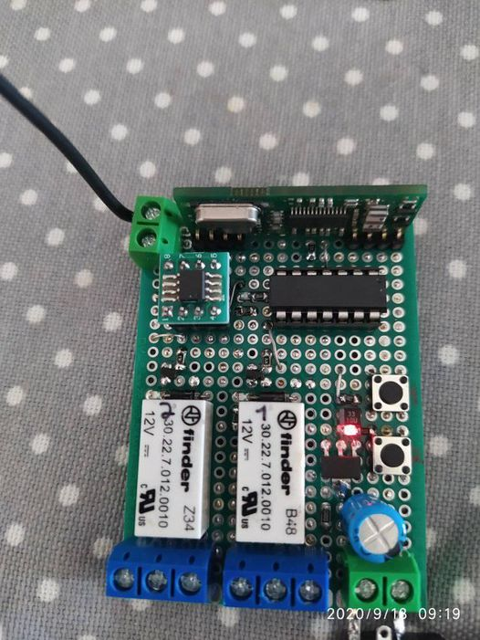

# RF433CH2V2
<b>This is a reverse engineering from a 433 receiver that sels on ebay, aliexpress and others named as YET40PC.</b>
But this module don't have a very good radio receiver, so a build a new one with a better receiver.
 
Max codes	400 codes on eprom 24lc16B
 
Fix code	2260 2264 2262 5326 
 
Rolling Code	hcs301 300 201 200
 

